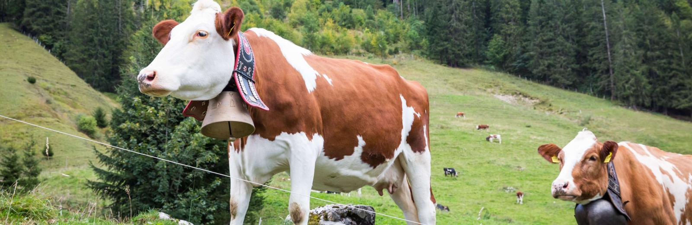
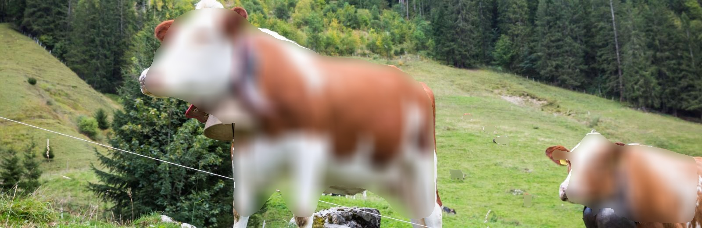

# object-blurring-using-Mask-RCNN
object blurring for preventing violation of community guidelines in social media.

This model detects the object and blur the object. this model can be trained with images containing object which is needed to be blurred.

This Repo is just a tiny modification of Matterports MaskRCNN Repo link is [here](https://github.com/matterport/Mask_RCNN) .
This repository contains the prediction and modified visualisation algorithm of Mask rcnn.

Install required libraries

    pip install -r requirements.txt

<h1>Pre-trained data</h1>

This model is implemented using a model pre-trained on MS COCO.All you need to do is download the pre-trained weights [here](https://github.com/matterport/Mask_RCNN/releases/download/v2.0/mask_rcnn_coco.h5).
Copy and paste the downloaded weight file inside mrcnn folder.

Then give the path of weight file to 'MRCNN_model_path' in image.py and video.py .

Ex:- MRCNN_model_path = "mrcnn\\mask_rcnn_coco.h5".

This model contains 81 classes of objects -

['BG', 'person', 'bicycle', 'car', 'motorcycle', 'airplane',
               'bus', 'train', 'truck', 'boat', 'traffic light',
               'fire hydrant', 'stop sign', 'parking meter', 'bench', 'bird',
               'cat', 'dog', 'horse', 'sheep', 'cow', 'elephant', 'bear',
               'zebra', 'giraffe', 'backpack', 'umbrella', 'handbag', 'tie',
               'suitcase', 'frisbee', 'skis', 'snowboard', 'sports ball',
               'kite', 'baseball bat', 'baseball glove', 'skateboard',
               'surfboard', 'tennis racket', 'bottle', 'wine glass', 'cup',
               'fork', 'knife', 'spoon', 'bowl', 'banana', 'apple',
               'sandwich', 'orange', 'broccoli', 'carrot', 'hot dog', 'pizza',
               'donut', 'cake', 'chair', 'couch', 'potted plant', 'bed',
               'dining table', 'toilet', 'tv', 'laptop', 'mouse', 'remote',
               'keyboard', 'cell phone', 'microwave', 'oven', 'toaster',
               'sink', 'refrigerator', 'book', 'clock', 'vase', 'scissors',
               'teddy bear', 'hair drier', 'toothbrush']
               

As there is 81 classes, the 'NUM_CLASSES' variable in image.py and video.py should be 81  Ex:- "NUM_CLASSES = 81"

<h1>Custom trained data</h1>

This model can be trained from [this_repository](https://github.com/matterport/Mask_RCNN) .

For hiding vulgar or explicit content from your media file, you might need images containing it for training.

The weight file obtained after training is to be copied in mrcnn folder.

Then give the path of weight file to 'MRCNN_model_path' in image.py and video.py .

Ex:- MRCNN_model_path = "mrcnn\\mask_rcnn_custom_0020.h5".

The 'NUM_CLASSES' variable in image.py and video.py should be assigned with no of objects labeled while training.

<h1>Prediction(image)</h1>

run

    python image.py path_to_image

Below are the examples of the model

<h1>Sample image</h1>

<h1>Output image</h1>

<h1>Prediction(video)</h1>

run

    python image.py path_to_video

<h1>Output</h1>

